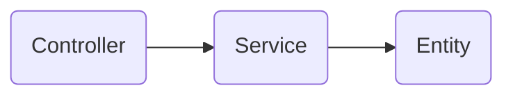

# Architecture

The project architecture is strongly inspired by Bob Martin's Clean Architecture model.
It's a pattern that emphasizes the separation and the independence of the different layers and components in a application.
Layers are linked from inner to outer :


## Middlewares
Within the express router, before a controller, you can pass middlewares or validators.
By design middelwares are not intended to have return statement, but rather to validate or execute certain block of logic and pass it to the next express router method.
In case you need to return data from middleware, please ensure that the type of return object is same as  ```IController```.

## Router handler callback
Router handler callback is a callback function that is passed as an argument to another async function and is intended to be invoked during function call. Async function accepts the same arguments as express framework (```req```, ```res``` and ```next```).  

##  Wrapper function for router method arguments 
For router method arguments which are ```Async Function``` a utility function (```addCallbackToRouterArgs```) is provided that allows you to pass such arguments without invoking callback routine in the method call.
For example, typically router method call would look like this:

```demoRouter.get("/", callback(demoValidator), callback(demoController));```

By creating a router using provided utility function, you can invoke router methods without callbacks, like shown in the example below, providing us with better modularity and reusability of the code:

```
const  demoRouter  =  addCallbackToRouterArgs(Router());
demoRouter.get("/", demoValidator, demoController);
addCallbackToRouterArgs(demoRouter);
```

# Dependencies

- Express
- PostgreSQL (or other DB of your choice) 
- ES-lint
- Prettier
- Jest
- Lint-staged
- Husky
- Typescript
- Nodemon

Upon executing ```npm install``` a sniffer script is generated that listens on ```git commit``` command and automatically invokes testing, linting and formatting the code in a single action (read more https://typicode.github.io/husky/ ). 

Note: If you don't have postgresql installed on your mashine, upon ```npm run start``` server should throw an error, but app will be usable.
